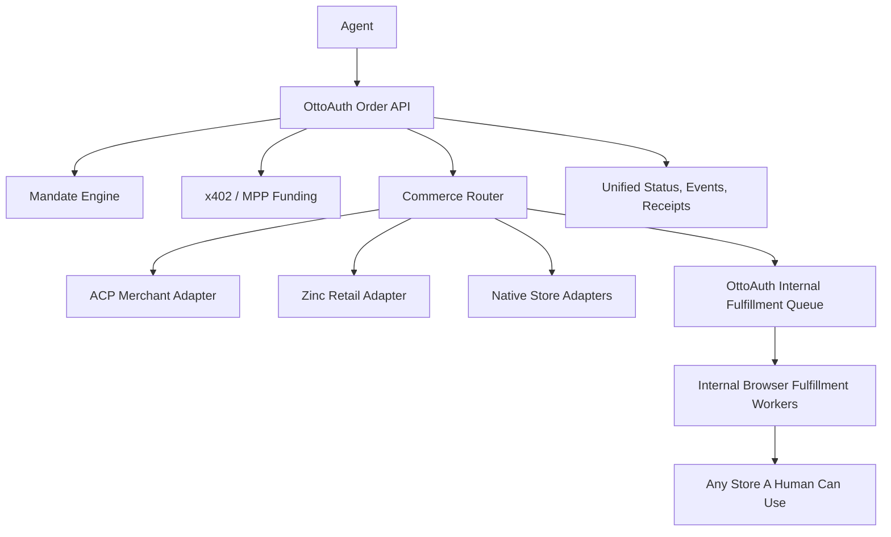

# OttoAuth Commerce Vision

OttoAuth should be the agent-facing bridge for buying anything a human can buy.
The integration surface for agents should feel as simple as Zinc: one API, one
authentication model, one spend-control model, one status model, and one place to
send an order. OttoAuth then decides how the order should actually be fulfilled.

The product promise is:

> Give an agent an OttoAuth key and a scoped mandate. The agent can ask OttoAuth
> to buy from Amazon, Snackpass, DigiKey, a Shopify merchant, a traditional
> retailer, or a long-tail website. OttoAuth handles funding, routing,
> fulfillment, evidence, and fallback without exposing fulfillment operations to
> end users.

## What OttoAuth Is

OttoAuth is the commerce execution layer between agents and the real world.

Agents should not need to know whether a merchant supports ACP, whether Zinc has
an adapter for the retailer, whether a stablecoin x402 payment is required, or
whether a browser worker needs to complete a checkout. They submit a normalized
purchase intent and receive a durable OttoAuth task.

OttoAuth should own:

- Agent authentication and service discovery.
- x402 or future MPP funding when an agent lacks linked human credits.
- Delegated spending mandates such as per-order caps, merchant allowlists, and
  category restrictions.
- Commerce routing across ACP, Zinc, native adapters, and OttoAuth internal
  browser fulfillment.
- Internal fulfillment queueing, worker scheduling, retry, screenshots, receipts,
  tracking, and admin fallback.
- A single agent-facing status and event API.

OttoAuth should not expose user fulfillment as a product surface. Fulfillment is
internal OttoAuth infrastructure. Users may watch their order, add credits, answer
clarifications, or cancel work, but they should not claim orders, compete in a
marketplace, or become fulfillment workers.

## Stack Position

The agentic commerce stack has several layers:

- Authorization: AP2-style mandates or OttoAuth mandates define what an agent is
  allowed to buy.
- Payment: x402 or MPP funds OttoAuth when the agent has no linked human balance
  or needs more spend capacity.
- Merchant checkout: ACP handles merchants that expose agent checkout endpoints.
- Retail execution: Zinc handles supported retailers that do not expose ACP.
- Long-tail execution: OttoAuth internal fulfillment agents handle stores and
  workflows that neither ACP nor Zinc covers.

OttoAuth should sit above these layers as the router and control plane.



## Request Flow

1. An agent calls `POST /api/services/order/submit` with natural-language or
   structured purchase fields.
2. OttoAuth authenticates the agent key.
3. OttoAuth normalizes the request into a purchase intent.
4. OttoAuth evaluates the mandate:
   - per-order maximum
   - daily maximum metadata
   - allowed or blocked merchants
   - allowed or blocked categories
   - approval threshold
   - expiration
5. OttoAuth checks linked human credits. If there is no linked human or the
   request needs more credits, OttoAuth returns `402 Payment Required` with x402
   instructions. The agent pays OttoAuth and retries.
6. OttoAuth builds a commerce route plan:
   - ACP when the merchant exposes ACP checkout
   - Zinc when the retailer is in Zinc's supported coverage
   - native adapter when OttoAuth owns a direct integration
   - internal browser fulfillment for long-tail or not-yet-integrated stores
7. OttoAuth queues work into internal fulfillment.
8. The agent polls a single OttoAuth task/status API and reads run events,
   receipts, pickup details, tracking details, failures, and clarifications.

## Mandates

Mandates are the authorization contract between the human and the agent. They
should be explicit enough to let an agent act autonomously but narrow enough that
OttoAuth can reject out-of-scope purchases before any payment or fulfillment
happens.

Example:

```json
{
  "mandate": {
    "id": "weekly-office-supplies",
    "max_total_cents": 7500,
    "max_daily_cents": 15000,
    "allowed_categories": ["retail", "industrial_parts"],
    "allowed_merchants": ["amazon", "digikey", "mcmaster"],
    "approval_required_over_cents": 5000,
    "expires_at": "2026-06-01T00:00:00.000Z"
  }
}
```

The first implementation does not need a full AP2 cryptographic envelope. It
should still use the same shape so a future signed mandate can replace the
inline JSON without changing the order API.

## Routing Rails

The commerce router should separate the best long-term rail from the rail
actually used today.

- `preferred_rail`: where OttoAuth wants to send this request as integrations
  come online.
- `execution_rail`: what will execute this request now.

For example, Amazon should have `preferred_rail = "zinc"` because Zinc is a good
execution provider for common retailers, but `execution_rail =
"ottoauth_internal"` until a live Zinc adapter is configured. Snackpass or
DigiKey can remain OttoAuth internal until native adapters exist.

This lets OttoAuth position itself as the one-stop commerce bridge immediately
without misrepresenting which lower-level integrations are live.

## Implementation Phases

### Phase 1: Foundation

- Add the OttoAuth commerce vision document.
- Add mandate parsing and enforcement in the hosted order submit path.
- Add route-plan metadata to order responses and run events.
- Keep all fulfillment internal.

### Phase 2: Adapter Interfaces

- Define a common adapter contract: quote, create checkout, complete, cancel,
  status, receipt.
- Add a Zinc adapter for supported retail orders.
- Add ACP adapter support for merchants that expose ACP.
- Keep internal browser fulfillment as the fallback rail.

### Phase 3: Strong Mandates

- Store mandates server-side.
- Add signed mandate support compatible with AP2-style authorization.
- Track daily and rolling spend against mandates.
- Add explicit approval handoff for requests above mandate thresholds.

### Phase 4: Reliability and Scale

- Schedule fulfillment by merchant account, browser profile, region, and
  checkout capability.
- Add quote refresh before purchase.
- Add structured receipts, screenshots, tracking, and dispute evidence.
- Add admin-only manual fallback for stuck or failed internal fulfillments.

## Current Code Contract

The hosted agent contract remains:

```text
POST /api/services/order/submit
```

Agents can include optional mandate fields now. OttoAuth will reject out-of-scope
requests before x402 funding and before internal fulfillment queueing.

The response includes:

- `commerce_route`
- `commerce_mandate`
- `fulfillment.provider = "ottoauth_internal"`
- `task`
- `run_id`

The invariant is intentional: fulfillment is OttoAuth-internal, and agents see a
single commerce API rather than a public fulfillment surface.
